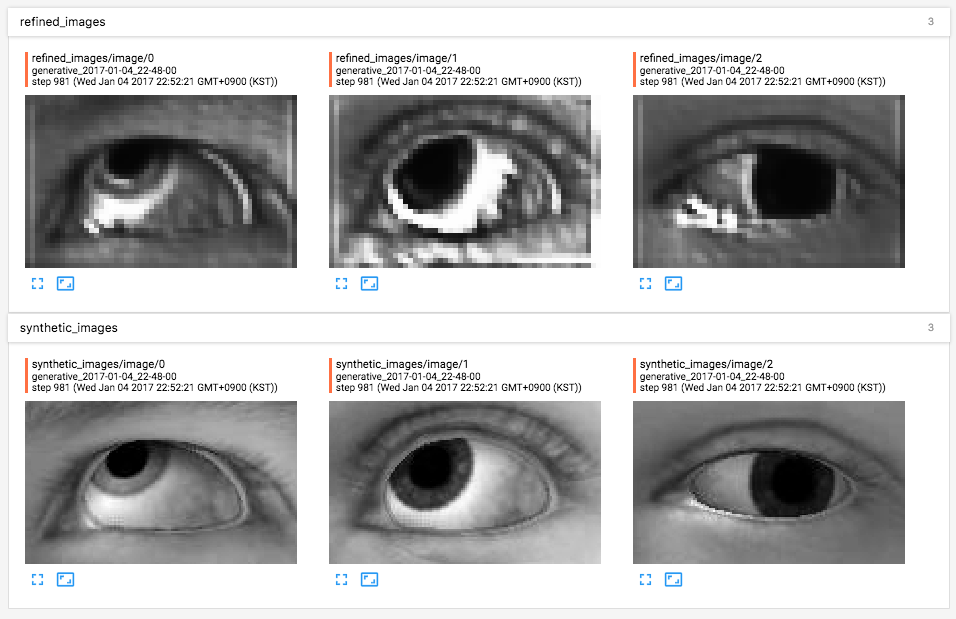

# Simulated+Unsupervised (S+U) learning in TensorFlow

TensorFlow implementation of [Learning from Simulated and Unsupervised Images through Adversarial Training](https://arxiv.org/abs/1612.07828).

## Requirements

- Python 2.7
- [TensorFlow](https://www.tensorflow.org/) 0.12.0
- [SciPy](http://www.scipy.org/install.html)
- [pillow](https://github.com/python-pillow/Pillow)
- [tqdm](https://github.com/tqdm/tqdm)

## Usage

To generate synthetic dataset:

1. Run [UnityEyes](http://www.cl.cam.ac.uk/research/rainbow/projects/unityeyes/) with changing `resolution` to `640x480` and `Camera parameters` to `[0, 0, 20, 40]`.
2. ...

The `data` directory should looks like:

    data
    ├── gaze
    │   ├── MPIIGaze
    │   │   └── Data
    │   │       └── Normalized
    │   │           ├── p00
    │   │           ├── p01
    │   │           └── ...
    │   └── UnityEyes # contains images of UnityEyes
    │       ├── 1.jpg
    │       ├── 2.jpg
    │       └── ...
    ├── __init__.py
    ├── gaze_data.py
    ├── hand_data.py
    └── utils.py

To train a model:

    $ python main.py --data_set gaze
    $ python main.py --data_set hand

To test with an existing model:

    $ python main.py --data_set gaze --test
    $ python main.py --data_set hand --test

## Results

(in progress)

## Author

Taehoon Kim / [@carpedm20](http://carpedm20.github.io)
